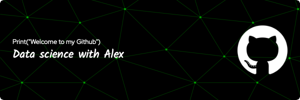

### Hi, I'm Alexander Neunreuther

- :bank: I am on a work-study program at the headquarters of the bank Credit Agricole Alsace-vosges

- :mortar_board: I study at the University of Strasbourg and I'm doing a master degree in data science

- :signal_strength: Im currently learning machine learning and deep learning

### Connect with me:

&nbsp;&nbsp;

### Languages and Tools:

[]
[]
[]
[]
[]

